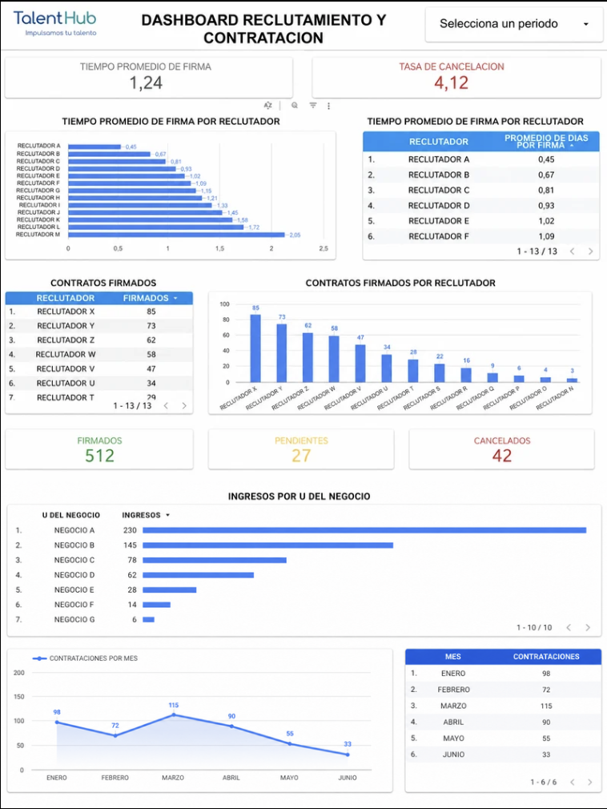

# Recruitment Analytics Dashboard

## Key Metrics Monitored

- Average Time to Hire
- Contract Cancellation Rate
- Contracts Signed by Recruiter
- Average Time to Signature by Recruiter
- Recruiter Performance Comparison
  
## Business Problem

Recruitment tracking was conducted manually using spreadsheets and WhatsApp communication, resulting in fragmented information, limited visibility, and time-consuming reporting processes.

## Project Objective

To design an interactive dashboard that centralizes recruitment data and provides real-time insights to support strategic decision-making.

## Tools Used

- Google Sheets
- SQL
- BigQuery
- Looker Studio

## Business Impact

- Reduced time spent preparing recruitment reports.
- Centralized recruitment information into a single source of truth.
- Improved visibility of recruiter performance indicators.
- Enabled data-driven decision-making in talent acquisition processes.
